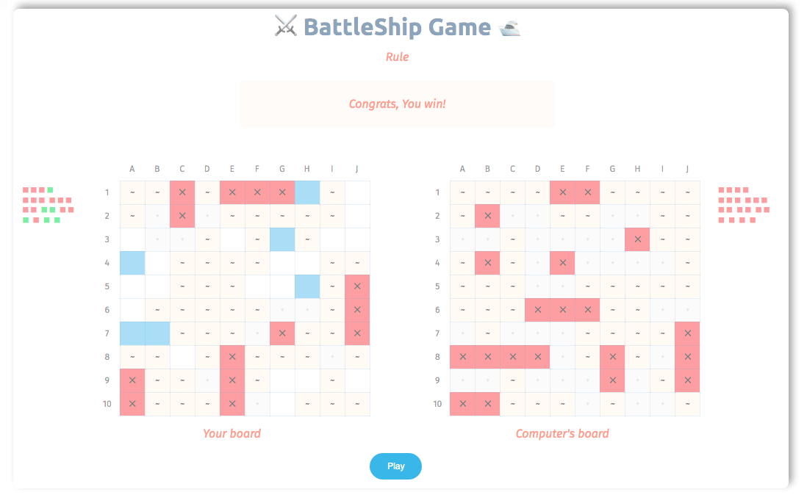

<h1 align="center">⚔️ BattleShip Game Project 🛥</h1>

<p align="center">
  
  <a href="#" target="_blank">
    
  </a>
  <a href="https://twitter.com/kelvin9877" target="_blank">
    
  </a>
  <a href="https://app.netlify.com/sites/battleshipgame/deploys" target="_blank">
    
  </a>
</p>

> This is an Odin Project assignment for practicing Unit Test and Testing Driven Development (TDD) methodologies combine some best practices in current Javascript coding trend (2020).

[](https://battleshipgame.netlify.com/)

### ✨ [Demo](https://battleshipgame.netlify.com/)

### Key Concepts
* ES6 
* Object Oriented Programming (OOP)
* Testing Driven Development (TDD)
* Model View Controller (MVC)
* Factory Function

### Tech Stacks
* HTML/CSS/SASS
* Javascript
* Jest (Testing)
* Webpack (Building)
* ESlint (Syntax)

## To Run Locally

#### Install

```sh
npm install
```

#### Usage

```sh
npm run start
```
> Open `http://127.0.0.1:8080` in your browser.

## To Develop Locally

#### Run tests

```sh
npm run test
```
> or continue run continually
```sh
npm run test-watch
```

#### Development Build
```sh
npm run watch
```

#### Production Build
```sh
npm run build
```

## 🤝 Contributing
Contributions, issues and feature requests are welcome!

Feel free to check the [issues page](https://github.com/kelvin8773/odin-battle-ship/issues).


## Author

👤 **Kelvin Liang**

* Website: https://medium.com/@Kelvin9877
* Twitter: [@kelvin9877](https://twitter.com/kelvin9877)
* Github: [@kelvin8773](https://github.com/kelvin8773)
* LinkedIn: [@kelvin9877](https://linkedin.com/in/kelvin9877)

## Show your support

Give a ⭐️ if this project helped you!

***
_This README was generated with ❤️ by [readme-md-generator](https://github.com/kefranabg/readme-md-generator)_